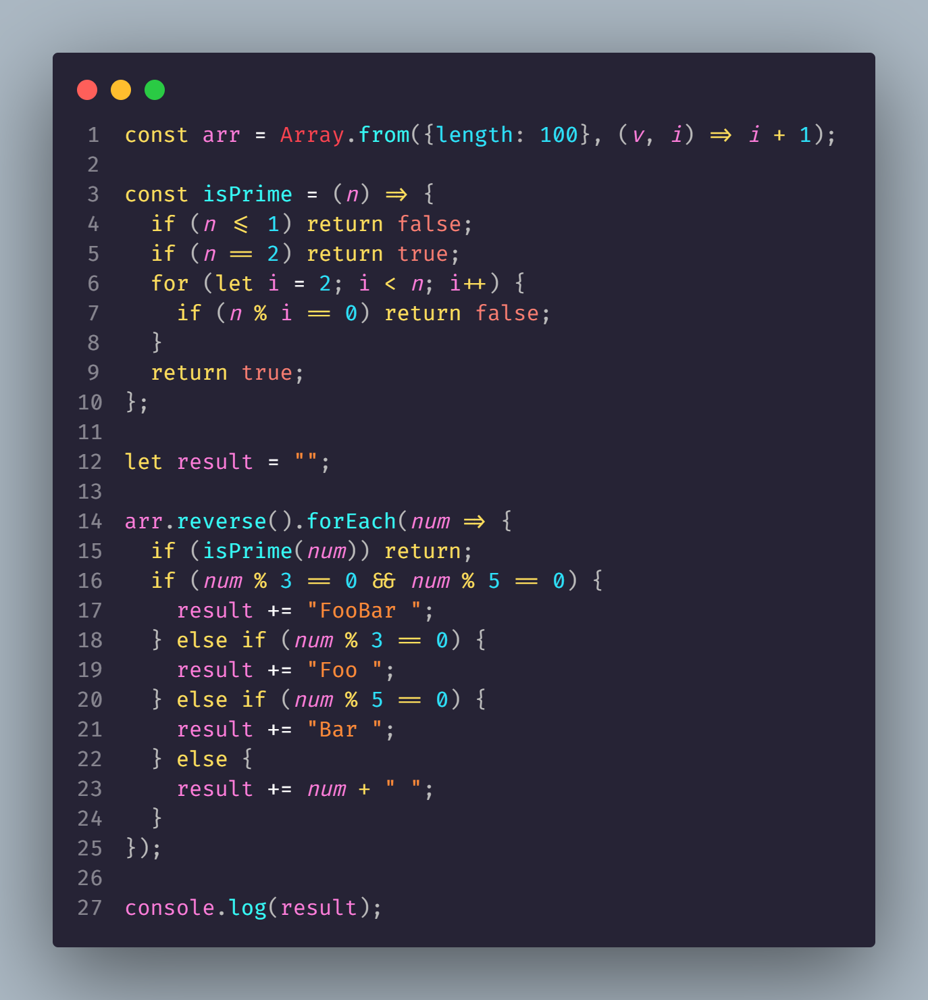
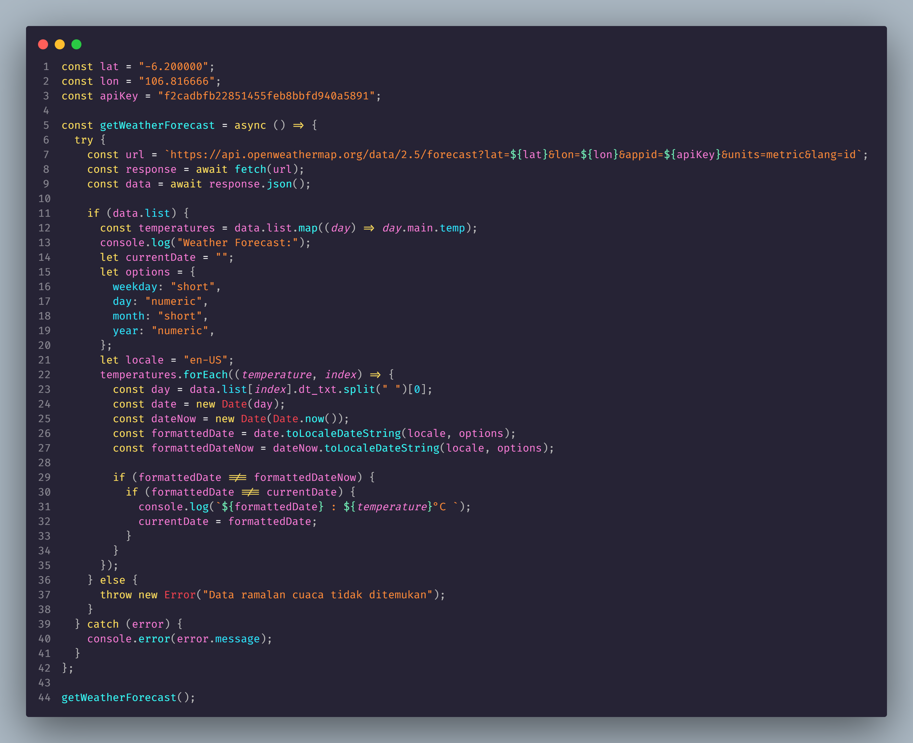

<h1 align="center">Mini Test STAMPS</h1>

###

<h2 align="left">Soal No 1</h2>

###

Tolong buat satu array / list dari 1 sampai 100. Print semua angka ini dalam urutan terbalik, tetapi ada beberapa peraturan :    - Jangan print angka bilangan prima. - Ganti angka yang dapat dibagi dengan angka 3 dengan text "Foo". - Ganti angka yang dapat dibagi dengan angka 5 dengan text "Bar". - Ganti angka yang dapat dibagi dengan angka 3 dan 5 dengan text "FooBar". - Print angka menyamping tidak ke bawah.

###
<h3 align="left">Code</h3>

  

###

<h3 align="left">Result</h3>

###

  

###

<h2 align="left">Soal No 2</h2>

###

Menampilkan ramalan cuaca kota Jakarta untuk 5 hari kedepan  - Silakan gunakan API yang disediakan http://openweathermap.org - Tolong tampilkan output berupa ramalan cuaca kota Jakarta untuk 5 hari ke depan - Yang ditampilkan hanya 1 suhu per hari

###
<h3 align="left">Code</h3>

  

###

<h3 align="left">Result</h3>

###

  

###